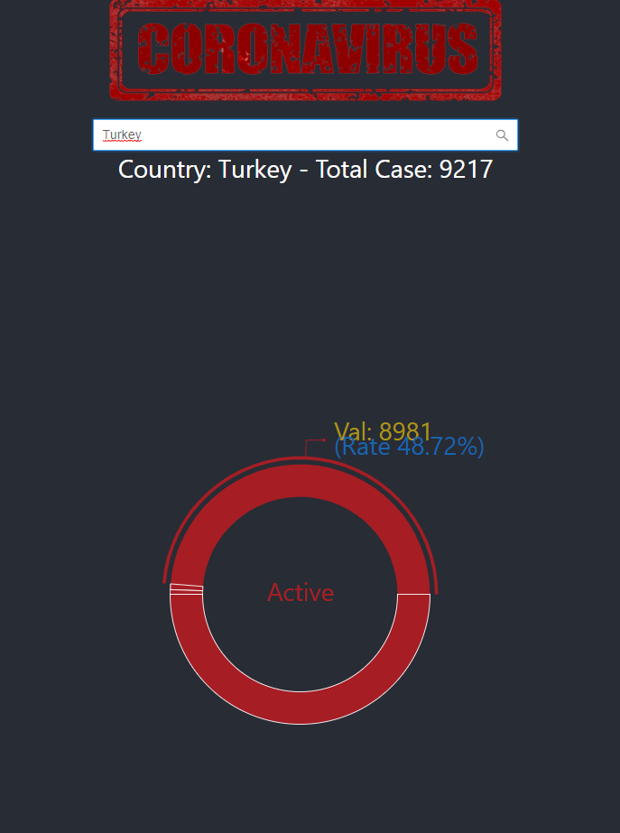

# coronavirus-info
This is a basic flask application to get daily coronavirus information. 



### Prerequisites

You need to install Python 3.6 or up


### Getting the project

1. Create project folder:
```
mkdir <your-project-name>
cd <your-project-name>
```
2. Clone the project:
```
git clone https://github.com/GokhanYilmaz44/coronavirus-info.git
```
3. Create a virtual environment:
```
python3 -m venv env

if you are using MAC or Linux:
source env/bin/activate

or Windows OS:
.\env\Scripts\activate
```
4. Install all dependencies:
```
pip install -r requirements.txt
```
5. Create initial database tables:
```
open python shell on your console
>> from app import db
>> db.create_all()
>> exit()
```

8. Run the project server:
```
python app.py
```

## Authors
* **Gokhan YILMAZ** [profile](https://github.com/GokhanYilmaz44)

